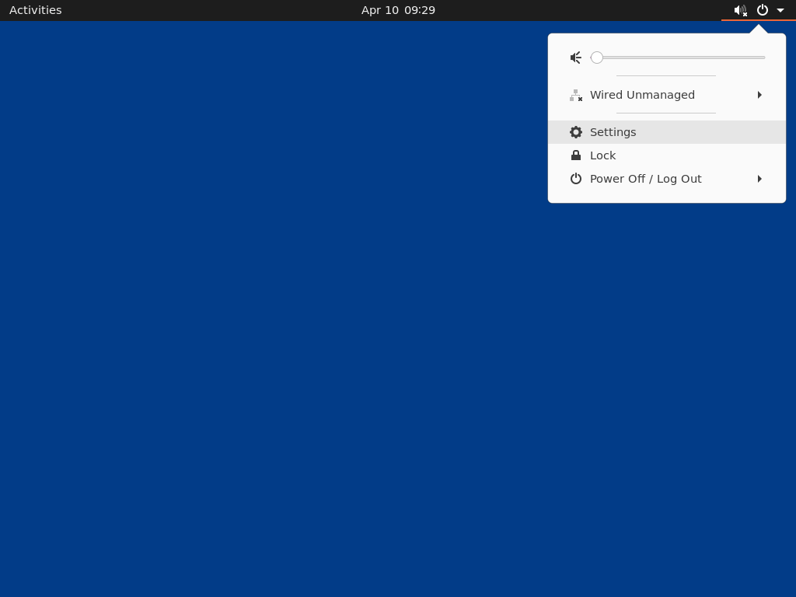
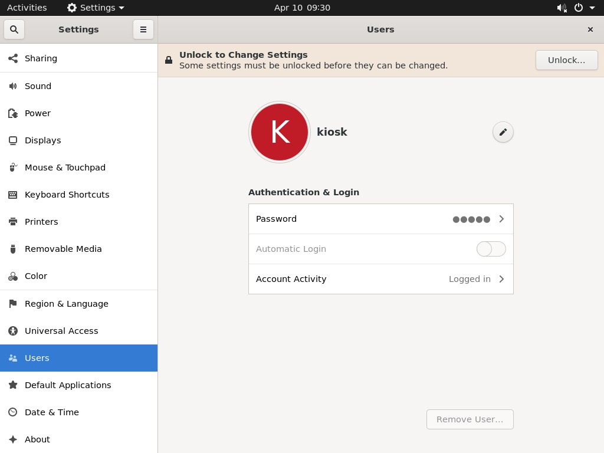
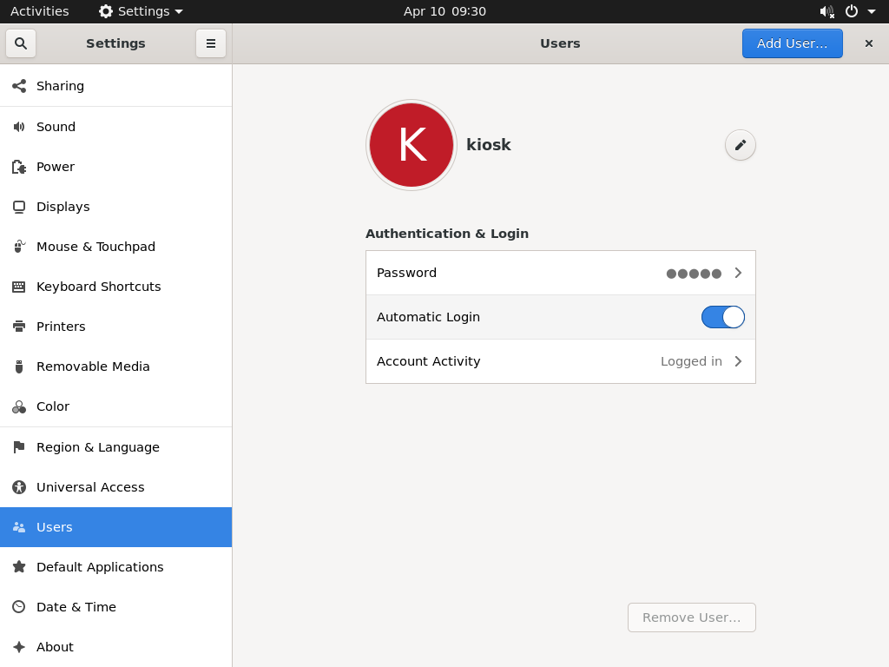

# OS Installation and Configuration for Kiosk
## Install Ubuntu Server 20.04 LTS
### After install Ubuntu Server 20.04 LTS , you should be connected to server by ssh and run below commands
#### Update and Upgrade OS
```bash
sudo apt update 
sudo apt upgrade -y
```
#### Install lightdm Xserver 
```bash
sudo apt install lightdm
```
#### Install Xserver xorg evdev and remove libinput for ILITEK Touchscreen
```bash
sudo apt install xserver-xorg-input-evdev
sudo apt remove xserver-xorg-input-libinput
sudo reboot
```
#### After install lightdm desktop environment we have to install gnome terminal because , it's already dos'nt installed
```bash
sudo apt install gnome-terminal
```
## AutoLogin setting in kiosk
# 
#### Go to setting

# 
#### Select Users

# 
#### Click (Unlock to Change Settings) and Change (Automatic Login) button

